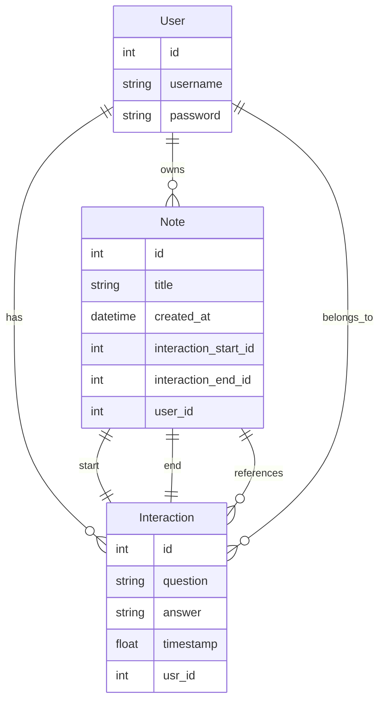
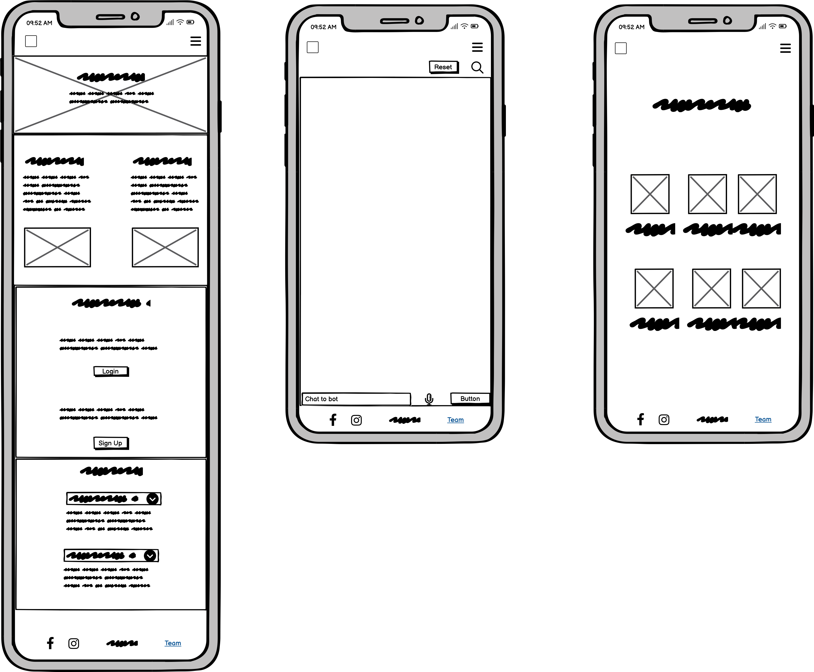
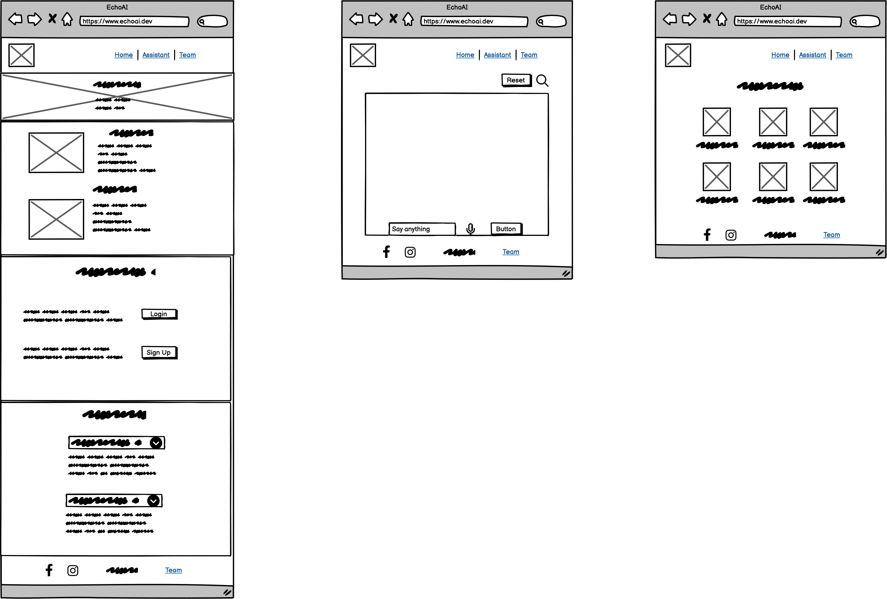

# The Digital Relatives
[](#)
[](#)
[](#)
[](#)
[](#)
[](#)

## Table of Contents
* [Project Description](#project-description)
* [Tech Stack](#tech-stack)
* [Features](#features)
* [LLM](#llm)
* [How to Use](#how-to-use)
* [Entity Relationship Diagram](#entity-relationship-diagram)
* [Manual Testing](#manual-testing)
* [Wireframes](#wireframes)
* [User Stories](#user-stories)
* [Future Enhancements](#future-enhancements)
* [Credits](#credits)

## Project Description
<details><summary>Details</summary>

This project is a mock "tech support" web application designed to help family members, especially elderly relatives, with their technical issues. Users can type in their questions, and the application will use AI to generate helpful responses.  The goal is to make technology more accessible and less intimidating for those who may not be as familiar with it.

For example, a user could ask:

* "How do I reset my WiFi?"
* "How do I download Facebook?"

[Back to Table of Contents](#table-of-contents)
</details>

## Tech Stack
<details><summary>Details</summary>

*  **Backend:** Django
*  **Frontend:** HTML, CSS, JavaScript, Bootstrap
*  **AI:** Google Generative Language AI (Model: gemini-1.5-flash-002)

[Back to Table of Contents](#table-of-contents)
</details>

## Features
<details><summary>Details</summary>

* AI-powered question answering: Users can type in their tech support questions and receive AI-generated responses.
* User-friendly interface: The application is designed to be simple and easy to use, especially for elderly users.
* Web-based:  Accessible from any device with a web browser.

[Back to Table of Contents](#table-of-contents)
</details>

## LLM

The application suses Google Gemin's LLM in the assistant app. 

### Setting up the API

1. It is mandatory to have an account with Google
2. Go to the Google Cloud Console
3. Create a new Project
4. Enable Gemini API in that project
5. Create a Service Account
6. Grant the Service Account Access
7. Create and download Service Account Key
8. Use the downloaded JSON file in your Django Project inside .env under the key **GOOGLE_APPLICATION_CREDENTIALS="path/to/the/file"**

[Back to Table of Contents](#table-of-contents)

<details><summary>Details</summary>

### Setting up Google's Gemini API with Django

This guide outlines the steps to set up and use Google's Gemini API in a Django project.

#### Prerequisites

* A Google Cloud Project with the Gemini API enabled.
* Python 3.7 or later installed.
* Django installed (refer to the [Django documentation](https://docs.djangoproject.com/en/stable/intro/install/) for installation instructions).
* `pip` (Python package installer).

#### Step 1: Set up Google Cloud Project and Enable the Gemini API

1.  **Go to the Google Cloud Console:**
    * Open your web browser and navigate to the [Google Cloud Console](https://console.cloud.google.com/).

2.  **Create a New Project or Select an Existing Project:**
    * If you don't have a project yet, create one.
    * If you have an existing project, select it.

3.  **Enable the Gemini API:**
    * In the Cloud Console, search for "Vertex AI API"
    * Click "Enable"

[Back to Table of Contents](#table-of-contents)

#### Step 2: Create a Service Account and Download Credentials

1.  **Create a Service Account:**
    * In the Cloud Console, navigate to "IAM & Admin" -> "Service Accounts".
    * Click "+ Create Service Account".
    * Enter a service account name (e.g., "gemini-django").
    * Click "Create".

2.  **Grant the Service Account Access:**
    * On the "Grant this service account access to project" page, under "Select a role", choose "Vertex AI" -> "Vertex AI User".
    * Click "Continue".
    * Click "Done".

3.  **Create and Download a Service Account Key:**
    * On the Service Accounts page, click on the service account you just created.
    * Go to the "Keys" tab.
    * Click "Add Key" -> "Create new key".
    * Select "JSON" as the key type.
    * Click "Create".
    * A JSON file containing your service account credentials will be downloaded to your computer. **Important:** Keep this file secure. Do not include it in your code repository.

[Back to Table of Contents](#table-of-contents)

#### Step 3: Set up your Django Project

1.  **Create a Django Project (if you don't have one):**

    ```bash
    django-admin startproject myproject
    cd myproject
    python manage.py startapp myapp  # Create an app within your project
    ```

2.  **Install the Google Generative AI library:**
    * Open a terminal and activate your virtual environment (if you are using one).
    * Install the `google-generativeai` library:

    ```bash
    pip install google-generativeai
    ```

[Back to Table of Contents](#table-of-contents)

#### Step 4: Configure Authentication in Django

1.  **Set the `GOOGLE_APPLICATION_CREDENTIALS` environment variable:**
    * This tells the Google client library where to find your service account credentials JSON file.
    * **Option 1: Set it in your system environment variables:** This is generally the recommended approach, especially for production.
        * Follow the instructions for your operating system (Windows, macOS, Linux) to set an environment variable. The variable name should be `GOOGLE_APPLICATION_CREDENTIALS`, and the value should be the absolute path to the JSON file you downloaded.
    * **Option 2: Set it in your Django `settings.py` (Less Recommended for Production):**
        * You can set the environment variable within your `settings.py` file, but this is generally less secure and not recommended for production.

        ```python
        import os
        os.environ["GOOGLE_APPLICATION_CREDENTIALS"] = "/path/to/your/service_account_key.json"  # Replace with the actual path
        ```

        * **Warning:** If you use this approach, make sure the path to your credentials file is not hardcoded in your code if you plan to deploy it. Use a relative path or a configuration setting.

[Back to Table of Contents](#table-of-contents)

#### Step 5: Use the Gemini API in your Django Views

1.  **Import the necessary libraries:**

    ```python
    from django.shortcuts import render
    from django.http import JsonResponse
    import google.generativeai as genai
    import os
    from django.views.decorators.csrf import csrf_exempt # If you're handling forms without Django's built-in CSRF protection
    ```

2.  **Configure the Gemini API and use it in a view:**

    ```python
    genai.configure(api_key=os.environ.get("GOOGLE_API_KEY")) #  Use the API key, or the GOOGLE_APPLICATION_CREDENTIALS env variable
    model = genai.GenerativeModel("gemini-pro") #  Specify the model you want to use

    @csrf_exempt #  Only if you're handling POST requests without Django's CSRF middleware
    def my_view(request):
        if request.method == 'POST':
            user_input = request.POST.get('user_input', '')  # Get user input from the request

            try:
                response = model.generate_content(user_input)
                ai_response = response.text
            except Exception as e:
                ai_response = f"Error: {e}"

            return JsonResponse({'response': ai_response})  # Return the response as JSON

        return render(request, 'myapp/my_template.html')  # Or render a template for a GET request
    ```

    * **`genai.configure(api_key=os.environ.get("GOOGLE_API_KEY"))`**: Configures the API key. It's better to use the `GOOGLE_APPLICATION_CREDENTIALS` environment variable
    * **`model = genai.GenerativeModel("gemini-pro")`**: Initializes the Gemini Pro model. You might choose a different model.
    * **`user_input = request.POST.get('user_input', '')`**: Gets the user's input from the POST request. Adjust this depending on how your form is set up.
    * **`response = model.generate_content(user_input)`**: Sends the user's input to the Gemini API and gets the response.
    * **`ai_response = response.text`**: Extracts the text from the response object.
    * **`JsonResponse({'response': ai_response})`**: Returns the AI's response as a JSON object, which you can then handle in your JavaScript code.
    * **`@csrf_exempt`**: If you're submitting data to this view using a form that doesn't use Django's built-in CSRF protection, you'll need this decorator. Otherwise, Django will block the request. If you are using Django's forms, you do not need this.

[Back to Table of Contents](#table-of-contents)

#### Troubleshooting

* **Authentication Errors:**
    * Make sure your `GOOGLE_APPLICATION_CREDENTIALS` environment variable is correctly set and points to a valid JSON file.
    * Double-check that the service account has the necessary permissions (Vertex AI User).
* **API Errors:**
    * Check the Google Cloud Console for any error messages related to the Vertex AI API.
    * Ensure that the Gemini API is enabled for your project.
* **Django Errors:**
    * Check your Django views, URLs, and templates for any syntax errors or logical issues.
    * Use Django's debugging tools (e.g., `print()` statements, the Django debug toolbar) to identify the source of the problem.


[Back to Table of Contents](#table-of-contents)

</details>

## How to Use
<details><summary>Details</summary>

1.  **Installation**
    * Clone the repository.
    * Set up a virtual environment (optional but recommended).
    * Install the required packages using `pip install -r requirements.txt`.
    * Set up your Google Cloud credentials (see "Configuration" below).
    * Run the Django migrations: `python manage.py migrate`.
    * Start the Django development server: `python manage.py runserver`.
    * Open your web browser and go to the provided URL (usually `http://127.0.0.1:8000`).

2.  **Configuration**
    * You will need a Google Cloud account and a project with the Gemini API enabled.
    * Set up authentication by creating a service account and downloading the credentials JSON file.
    * Set the `GOOGLE_APPLICATION_CREDENTIALS` environment variable to point to the path of your credentials JSON file.  **Important:** Do not include your credentials file in your code repository.
    * Ensure the Google Generative AI library is installed:  `pip install google-generativeai`

3.  **Usage**
    * Once the application is running, users can type their tech support questions into the input field on the main page.
    * The AI-generated response will be displayed on the page.

[Back to Table of Contents](#table-of-contents)
</details>

## Entity Relationship Diagram

<details><summary>Details</summary>



- Only the User model is shown from external packages.
- Note references a range of Interactions (from interaction_start_id to interaction_end_id).
- Each Interaction belongs to a User.
- Each Note belongs to a User.


[Back to Table of Contents](#table-of-contents)
</details>

## Manual Testing
<details><summary>Details</summary>

### Landing Page (`index.html`)

| TEST ACTION                                                                    | EXPECTATION                                                                                               | RESULT    |
| :----------------------------------------------------------------------------- | :-------------------------------------------------------------------------------------------------------- | :-------- |
| User opens the landing page URL                                                | The landing page is displayed with a title, introduction, and a call to action.                            | SUCCESS   |
| User views the page on different screen sizes (desktop, mobile)               | The layout is responsive and content is displayed correctly.                                               | SUCCESS   |
| User checks for broken links/images.                                            | All links are functional, and all images are displayed correctly.                                           | SUCCESS   |

### ASSISTANT

| TEST ACTION                                                                    | EXPECTATION                                                                                               | RESULT    |
| :----------------------------------------------------------------------------- | :-------------------------------------------------------------------------------------------------------- | :-------- |
| Sendiing an empty message | User sees an message that informs them that they first need to type in a message before sending it | SUCCESS |
| Sending a message - Click on send button| User sees loading spinner while the message is being processed | SUCCESS |
| Receiving a response | The message the user has sent appears in a speech bubble, followed by a speech bubble that contains the answer from the Assistant | SUCCESS |
| Click on clear chat history button | All the previous chat bubbles disappear | SUCCESS |
| Saving a conversation - Click on the dedicated button | A modal for saving the conversation appears | SUCCESS |
| Saving a conversation - In the modal the ttile field is empty and the user clicks on the 'OK' button | A vlidation message appears that reminds them that the title cannot be empty | SUCCESS |
| Saving a conversation - In the modal the user clicks on 'Cancel' | The modal closes | SUCCESS |
| Saving a conversation - In the modal the user enters a title and clicks on 'OK' | A message appears that informs the user that the conversation has been successfully saved and 3 seconds later they get redirected to the notes page | SUCCESS |


[Back to Table of Contents](#table-of-contents)

### NOTES

| TEST ACTION                                                                    | EXPECTATION                                                                                               | RESULT    |
| :----------------------------------------------------------------------------- | :-------------------------------------------------------------------------------------------------------- | :-------- |
| User clicks on one of the notes | A page with the chat history that was saved in that note opens | SUCCESS |
| Deleting a note - User clicks on the delete icon of a note | A modal window appears asking the user to confirm the delete | SUCCESS |
| Deleting a note - In confirmation modal user clicks on **No** | The modal window closes and the note remains intact | SUCCESS |
| Deleting a note - In confirmation modal user clicks on **Yes* | The modal window closes and the note disappears | SUCCESS |
| Filtering - User types in a word or phrase and clicks on **Filter** | Only notes that contain the string of characters submitted appear on the page | SUCCESS |


[Back to Table of Contents](#table-of-contents)
</details>


## Wireframes
<details><summary>Details</summary>

*
*

[Back to Table of Contents](#table-of-contents)
</details>

## User Stories
<details><summary>Details</summary>

* As a user, I want to be able to easily input my tech support question.
* As a user, I want to receive a helpful and accurate response to my question.
* As a user, I want the application to be easy to use, even if I am not very tech-savvy.
* As a user, I want to be able to store useful information
* As a user, I want the application to be accessible from any device with a web browser.


[Back to Table of Contents](#table-of-contents)
</details>

## Future Enhancements
<details><summary>Details</summary>

* Improved AI response accuracy and relevance, by using AI Agents in tandem with an LLM like Gemini, Chat-GPT, etc. This would make creating better designed responses pssible. For example, images, audio and video files could be embedded inside the AI responses
* User profiles, containing information about technical skills, enable AI responses to be tailored to match the user's understanding.
* Feedback mechanism for users to rate the helpfulness of the responses.
* Multi-language support.
* Use of external authenticaion services such as Google OAuth2, GitHub,Facebook, Twitter, Apple, Microsoft, etc. That way users would not have to sign up using a new set of credentials

[Back to Table of Contents](#table-of-contents)
</details>

## Credits
<details><summary>Details</summary>

* This project was created by Team5
</details>
